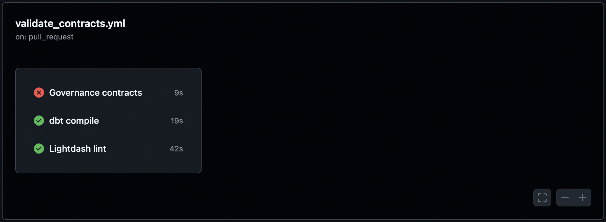
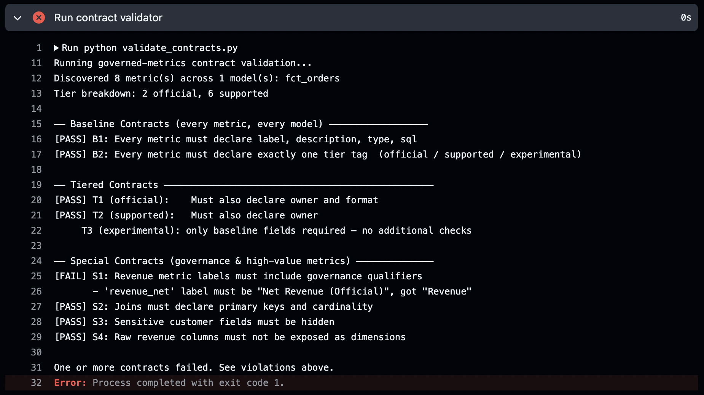

# governed-metrics-starter-kit

A dbt project demonstrating a **governed metrics layer**: a staging-to-marts architecture with Lightdash semantic layer config, dual revenue definitions, and a CI pipeline that blocks any PR that violates a metric contract.

## How it works

```
CSV seeds → staging (views) → marts (tables) → Lightdash semantic layer
                                                        ↑
                                          governed by metric contracts
                                          enforced on every PR via CI
```

The project enforces a three-tier metric governance system:

| Tier | Tag | Required fields | Who owns it |
|------|-----|-----------------|-------------|
| Official | `official` | label, description, type, sql, owner, format | Finance |
| Supported | `supported` | label, description, type, sql, owner | Growth / Finance |
| Experimental | `experimental` | label, description, type, sql | Anyone |

Every metric must declare exactly one tier tag. Promotion from experimental → supported → official is a deliberate, reviewable change.

See [contracts.md](contracts.md) for the full contract specification.

---

## Models

| Model | Layer | Materialization | Description |
|-------|-------|-----------------|-------------|
| `stg_customers` | Staging | View | Cleaned customer records |
| `stg_orders` | Staging | View | Cleaned order headers |
| `stg_order_items` | Staging | View | Cleaned order line items |
| `dim_customers` | Marts | Table | One row per customer |
| `fct_order_items` | Marts | Table | One row per line item, with `item_revenue` |
| `fct_orders` | Marts | Table | One row per order, with `gross_revenue` and `net_revenue` |

## Lineage

```
seeds/customers   → stg_customers   → dim_customers
seeds/orders      → stg_orders      ──────────────────────────┐
seeds/order_items → stg_order_items → fct_order_items → fct_orders
```

## Key metrics

| Metric | Model | Definition |
|--------|-------|------------|
| `item_revenue` | `fct_order_items` | `quantity × unit_price` |
| `gross_revenue` | `fct_orders` | `sum(item_revenue)` across all line items |
| `net_revenue` | `fct_orders` | `gross_revenue − refund_amount − discount_amount` |

## Materialization rationale

| Layer | Strategy | Why |
|-------|----------|-----|
| Staging | `view` | Zero storage cost; always reads fresh seed data; only lightweight type casts and renames |
| Marts | `table` | Aggregations (`SUM`, `COUNT`) are expensive to recompute on every query; analysts hit these models directly |

## Setup

### Prerequisites

- Python 3.9+
- pip

### Install

```bash
pip install dbt-postgres
```

### Configure profile

**Option A** — copy to the default dbt location:

```bash
cp profiles.yml ~/.dbt/profiles.yml
dbt build
```

**Option B** — pass the project root as the profiles directory on every command:

```bash
dbt build --profiles-dir .
```

### Run

```bash
# Load seed CSV data into Postgres
dbt seed --profiles-dir .

# Build all models
dbt run --profiles-dir .

# Run all tests (schema + singular business-logic)
dbt test --profiles-dir .

# Or do everything in one command
dbt build --profiles-dir .
```

A `profiles.yml` is required locally but is `.gitignore`d — see **Configure profile** above.

## Tests

Schema tests (`unique`, `not_null`, `relationships`, `accepted_values`) are defined in the `_*__models.yml` files alongside each model.

Three business-logic singular tests live in `tests/`:

| Test file | Rule enforced |
|-----------|---------------|
| `assert_discount_amount_non_negative` | `discount_amount >= 0` on every order |
| `assert_refund_amount_non_negative` | `refund_amount >= 0` on every order |
| `assert_net_revenue_calculation` | `net_revenue = gross_revenue − refund_amount − discount_amount` |

## CI

Every pull request to `master` triggers three parallel checks:

| Job | Tool | What it catches |
|-----|------|-----------------|
| **Governance contracts** | `pytest` + `validate_contracts.py` | Missing fields, wrong tier tags, ambiguous revenue labels, exposed PII or raw revenue columns, unsafe joins |
| **dbt compile** | `dbt-postgres` | Broken `ref()`, Jinja errors, invalid SQL syntax |
| **Lightdash lint** | `@lightdash/cli` | Invalid Lightdash YAML schemas (metric types, dimension config, join structure) |

Lightdash lint and the custom validator complement each other: lint checks **structure** (is this valid Lightdash config?), the validator checks **governance** (does this follow our rules?).

---

## Breaking change: what a failing PR looks like

To see the CI enforcement in action, make this change on a branch and open a PR:

**In `models/marts/fct_orders.yml`**, change the `revenue_net` label:

```yaml
# before — correct
revenue_net:
  label: "Net Revenue (Official)"

# after — breaks contract S1
revenue_net:
  label: "Revenue"
```

The `Governance contracts` CI job will fail. The **Run contract validator** step output:

```
Running governed-metrics contract validation...
Discovered 8 metric(s) across 1 model(s): fct_orders
Tier breakdown: 2 official, 6 supported

── Baseline Contracts (every metric, every model) ──────────────────
[PASS] B1: Every metric must declare label, description, type, sql
[PASS] B2: Every metric must declare exactly one tier tag  (official / supported / experimental)

── Tiered Contracts ─────────────────────────────────────────────────
[PASS] T1 (official):    Must also declare owner and format
[PASS] T2 (supported):   Must also declare owner
     T3 (experimental): only baseline fields required — no additional checks

── Special Contracts (governance & high-value metrics) ──────────────
[FAIL] S1: Revenue metric labels must include governance qualifiers
       - 'revenue_net' label must be "Net Revenue (Official)", got "Revenue"
[PASS] S2: Joins must declare primary keys and cardinality
[PASS] S3: Sensitive customer fields must be hidden
[PASS] S4: Raw revenue columns must not be exposed as dimensions

One or more contracts failed. See violations above.
Error: Process completed with exit code 1.
```




---

## Project structure

```
governed-metrics-starter-kit/
├── contracts.md                         # Contract specification
├── validate_contracts.py                # CI validator (baseline / tiered / special)
├── test_validate_contracts.py           # pytest unit tests for the validator
├── requirements.txt                     # pyyaml, pytest
├── dbt_project.yml
├── profiles.yml                         # gitignored — not committed
├── .github/
│   └── workflows/
│       └── validate_contracts.yml       # CI: governance + dbt compile + lightdash lint
├── seeds/
│   ├── customers.csv                    # 5 customers
│   ├── orders.csv                       # 15 orders
│   └── order_items.csv                  # 38 line items
├── models/
│   ├── staging/
│   │   ├── _staging__models.yml
│   │   ├── stg_customers.sql
│   │   ├── stg_orders.sql
│   │   └── stg_order_items.sql
│   └── marts/
│       ├── dim_customers.sql
│       ├── dim_customers.yml            # primary_key, PII hidden, Lightdash dimensions
│       ├── fct_order_items.sql
│       ├── fct_order_items.yml
│       ├── fct_orders.sql
│       └── fct_orders.yml              # 8 governed metrics, joins, group_details
└── tests/
    ├── assert_discount_amount_non_negative.sql
    ├── assert_refund_amount_non_negative.sql
    └── assert_net_revenue_calculation.sql
```
